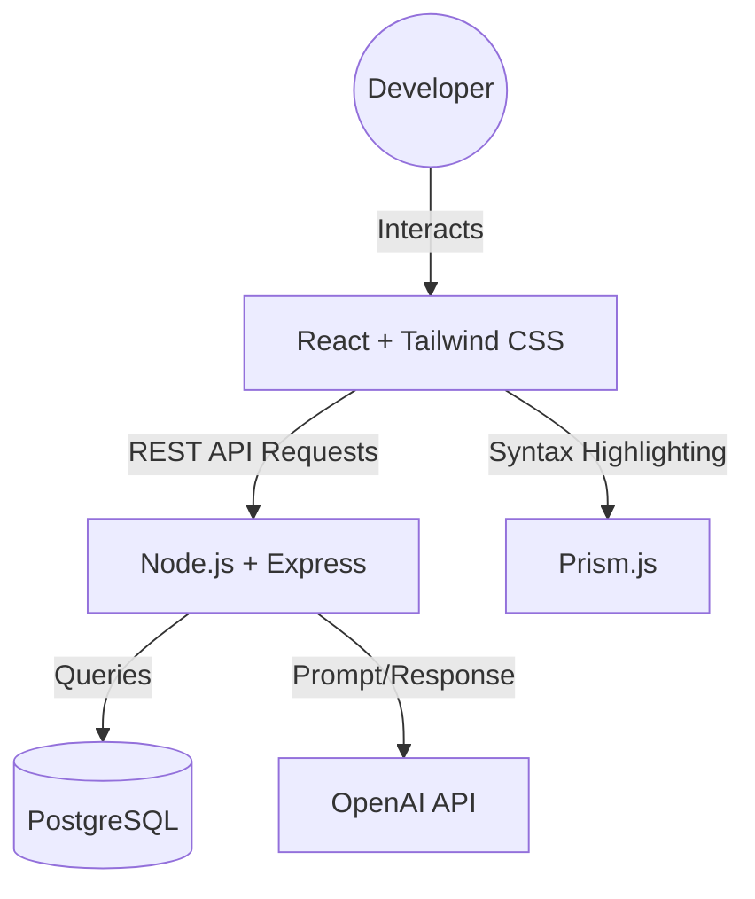

# Architecture Plan - AI Code Snippet Manager

## Overview
The AI Code Snippet Manager is a full-stack web application with a React frontend, a Node.js/Express backend, a PostgreSQL database, and OpenAI API integration for AI-powered tag suggestions and code explanations.

## High-Level Architecture Diagram

## Component Breakdown

### Frontend (React + Tailwind CSS)
- SnippetDashboard — Home page showing recent and frequently accessed snippets
- SnippetForm — Create and edit snippet with language selector and code editor
- SnippetViewer — Display snippet with syntax highlighting and copy button
- SearchFilterBar — Keyword search and filter by language or tag
- CollectionPanel — Sidebar for browsing and managing collections
- TagBadge — Reusable tag display component with AI-suggested indicator

### Backend (Node.js + Express)
- POST /snippets — Create a new snippet and trigger AI tag/explanation generation
- GET /snippets — Retrieve all snippets with optional search and filter params
- GET /snippets/:id — Retrieve a single snippet and increment access count
- PUT /snippets/:id — Update snippet details
- DELETE /snippets/:id — Delete a snippet
- GET /snippets/:id/explain — Request fresh AI explanation for a snippet
- GET /collections — List all collections
- POST /collections — Create a new collection

### AI Integration (OpenAI API)
- On snippet creation, backend sends code content to OpenAI API
- Prompt requests: 3-5 relevant tags and a 2-3 sentence plain-English explanation
- Response is parsed and stored in the snippet record automatically

### Database (PostgreSQL)
- Hosted on Supabase for managed PostgreSQL with instant REST API
- Schema managed via Prisma ORM with migration support

## Deployment Architecture
- Frontend — Vercel (static hosting with CI/CD from GitHub)
- Backend — Render (Node.js web service)
- Database — Supabase (managed PostgreSQL)

## Technology Stack

| Layer      | Technology           | Purpose                            |
|------------|----------------------|------------------------------------|
| Frontend   | React 18 + Vite      | UI framework and build tool        |
| Styling    | Tailwind CSS         | Utility-first CSS framework        |
| Highlighting | Prism.js           | Syntax highlighting for code view  |
| Backend    | Node.js + Express    | REST API server                    |
| ORM        | Prisma               | Database schema and query manager  |
| Database   | PostgreSQL (Supabase)| Persistent data storage            |
| AI         | OpenAI API (GPT-4o)  | Tag suggestion and code explanation|
| Deployment | Vercel + Render      | Frontend and backend hosting       |
| Testing    | Jest + Playwright    | Unit and end-to-end testing        |
