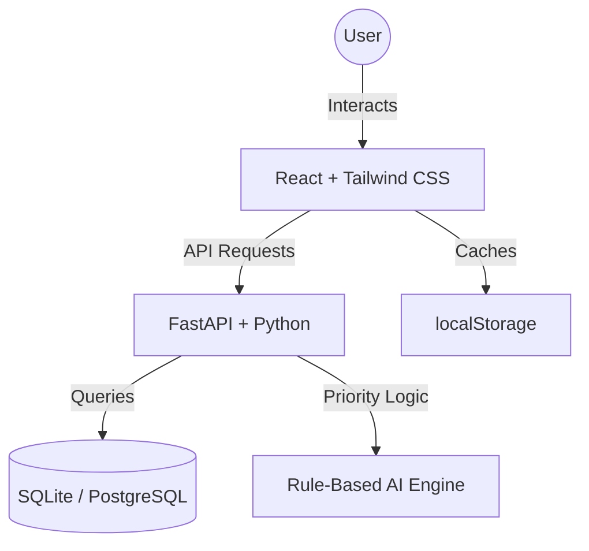

# System Architecture - Smart Task Manager

## Overview
The Smart Task Manager follows a client-server architecture with a React frontend, a FastAPI backend, and a SQLite database for the MVP phase.

## High-Level Diagram

## Component Breakdown

### Frontend (React + Vite + Tailwind CSS)
- TaskBoard — Kanban board component with drag-and-drop (react-beautiful-dnd)
- TaskCard — Individual task display with priority badge and deadline indicator
- TaskForm — Create/edit task modal with form validation
- Dashboard — Progress charts using Chart.js
- FilterBar — Status, priority, and date filter controls
- SearchBar — Real-time keyword search across tasks

### Backend (FastAPI + Python)
- GET /tasks — Retrieve all tasks with optional filter parameters
- POST /tasks — Create a new task
- PUT /tasks/{id} — Update an existing task
- DELETE /tasks/{id} — Delete a task
- GET /tasks/suggest-priority — Rule-based priority suggestion engine
- GET /tasks/summary — Aggregated dashboard statistics

### Database (SQLite via SQLAlchemy)
- Lightweight, file-based database suitable for MVP single-user deployment
- Managed via SQLAlchemy ORM with Alembic migrations

## Deployment Architecture
- Frontend — Deployed to Vercel (static hosting)
- Backend — Deployed to Render (Python web service)
- Database — SQLite file stored on Render persistent disk (upgradeable to PostgreSQL post-MVP)

## Technology Stack

| Layer      | Technology              | Purpose                        |
|------------|-------------------------|--------------------------------|
| Frontend   | React 18 + Vite         | UI framework and build tool    |
| Styling    | Tailwind CSS            | Utility-first CSS framework    |
| Backend    | FastAPI (Python 3.11)   | REST API server                |
| ORM        | SQLAlchemy              | Database abstraction layer     |
| Database   | SQLite                  | Lightweight data storage       |
| Deployment | Vercel + Render         | Frontend and backend hosting   |
| Testing    | pytest + Jest           | Backend and frontend testing   |
